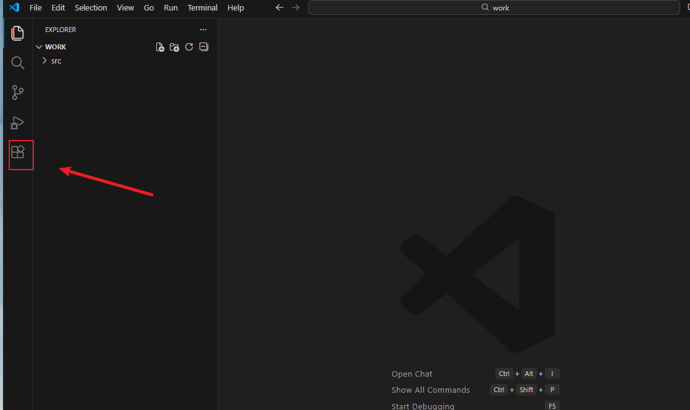
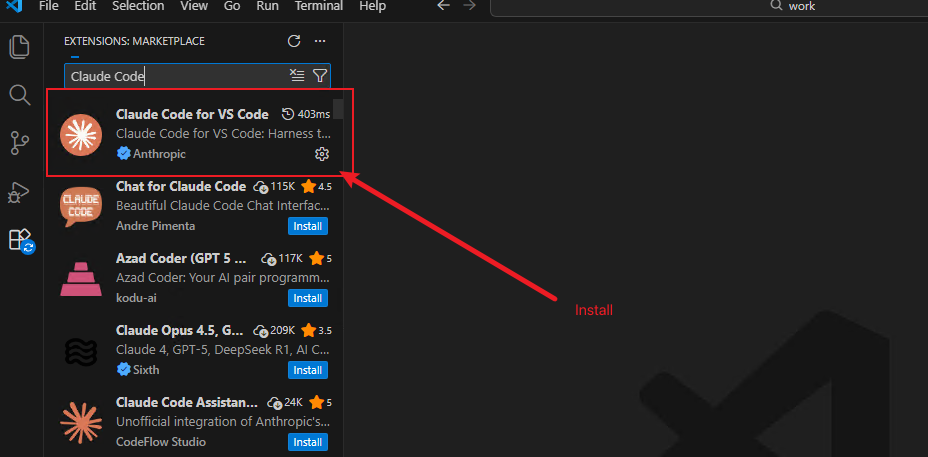
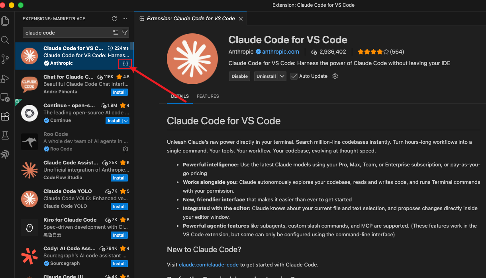
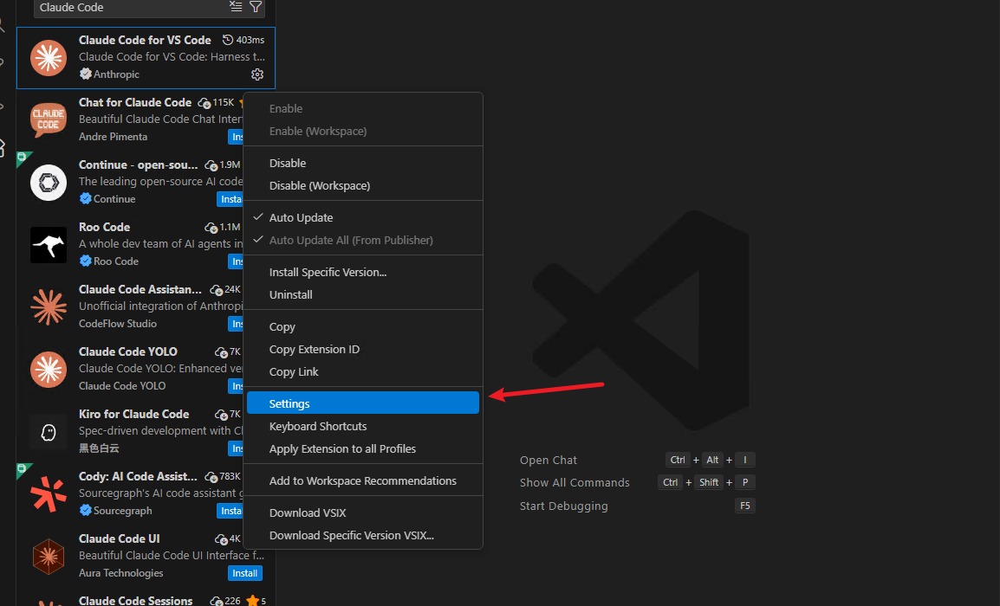
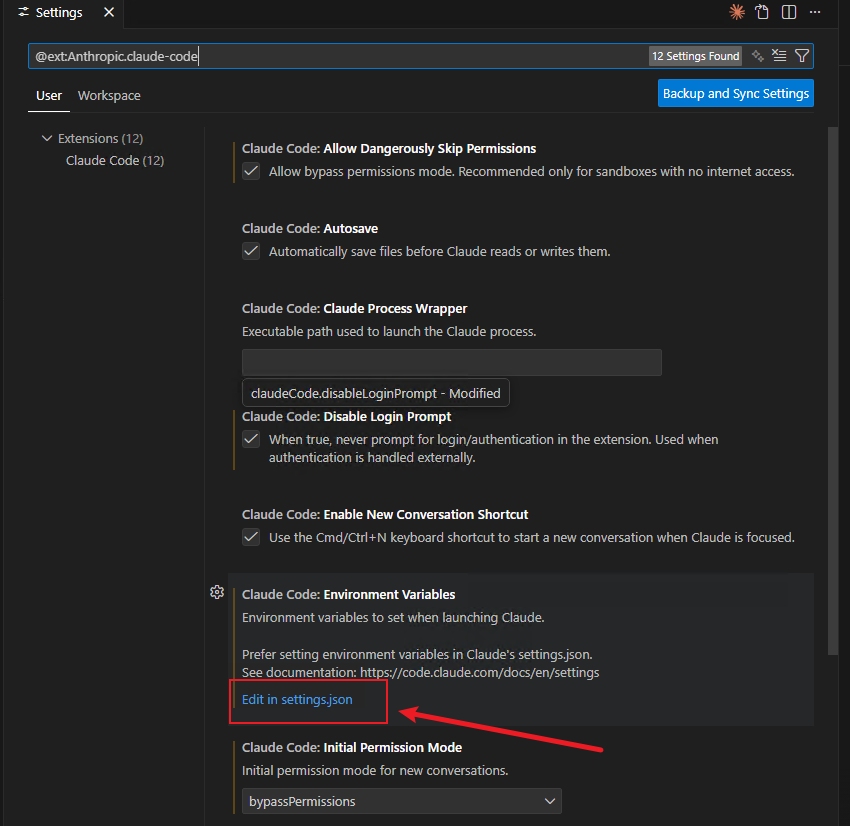
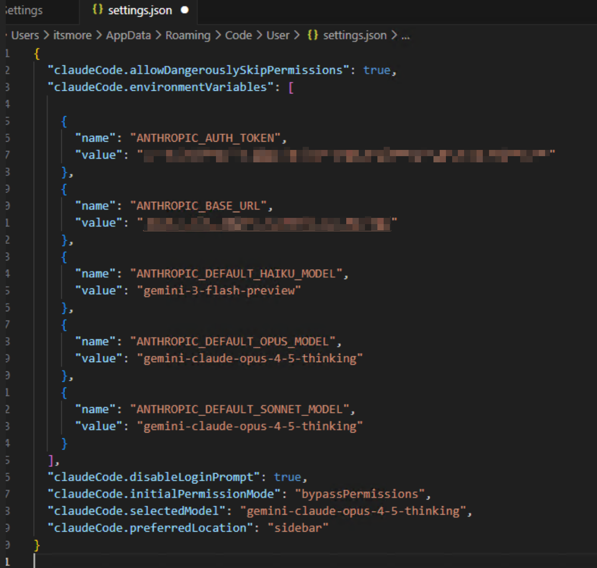
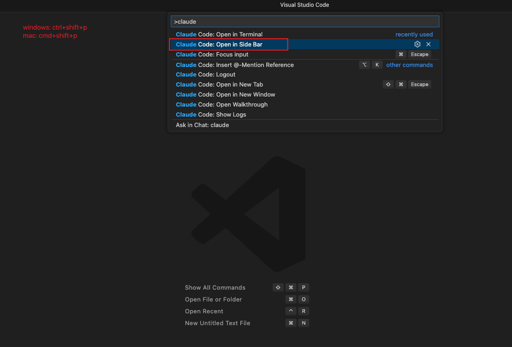
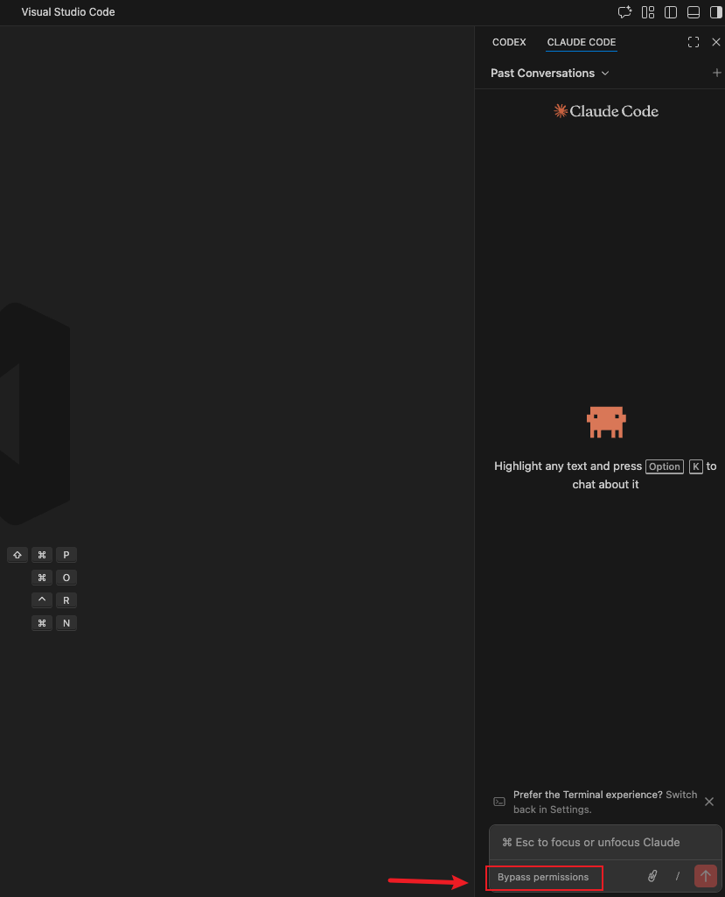

# VSCode Claude 扩展安装指南

本文档将指导你如何在 VSCode 中安装和配置 Claude 扩展。

## 1. 搜索 Claude 扩展

打开 VSCode，点击左侧活动栏中的扩展图标，在搜索栏中输入 `claude code`。

在搜索结果中，找到由 **Anthropic** 发布的 **Claude Code** 扩展。



## 2. 安装扩展

点击 Claude Code 扩展进入详情页面，然后点击右侧的 **Install** 按钮进行安装。



## 3. 配置扩展

安装完成后，点击 **齿轮** 按钮。



选择 **Settings** 菜单。



点击 **Edit in settings.json** 链接。



导入 **settings.json** 文件内容，若原先有配置，可以保留原有配置。

注意修改 **ANTHROPIC_AUTH_TOKEN** 和 **ANTHROPIC_BASE_URL** 的值。

```json
{
  "claudeCode.allowDangerouslySkipPermissions": true,
  "claudeCode.environmentVariables": [
  
    {
      "name": "ANTHROPIC_AUTH_TOKEN",
      "value": "sk-xxx"
    },
    {
      "name": "ANTHROPIC_BASE_URL",
      "value": "https://yourapidomain.com"
    },
    {
      "name": "ANTHROPIC_DEFAULT_HAIKU_MODEL",
      "value": "gemini-3-flash-preview"
    },
    {
      "name": "ANTHROPIC_DEFAULT_OPUS_MODEL",
      "value": "gemini-claude-opus-4-5-thinking"
    },
    {
      "name": "ANTHROPIC_DEFAULT_SONNET_MODEL",
      "value": "gemini-claude-opus-4-5-thinking"
    }
  ],
  "claudeCode.disableLoginPrompt": true,
  "claudeCode.initialPermissionMode": "bypassPermissions",
  "claudeCode.selectedModel": "gemini-claude-opus-4-5-thinking",
  "claudeCode.preferredLocation": "sidebar"
}
```




## 4. 使用扩展

使用快捷键 `Ctrl+Shift+P`(Windows) 或 `Cmd+Shift+P`(Mac)，输入 `Claude Code`，选择 `Claude Code: Open in Side Bar`。

在侧边栏中，你可以看到 Claude 的聊天界面。



可以切换 bypassPermissions 模式。


